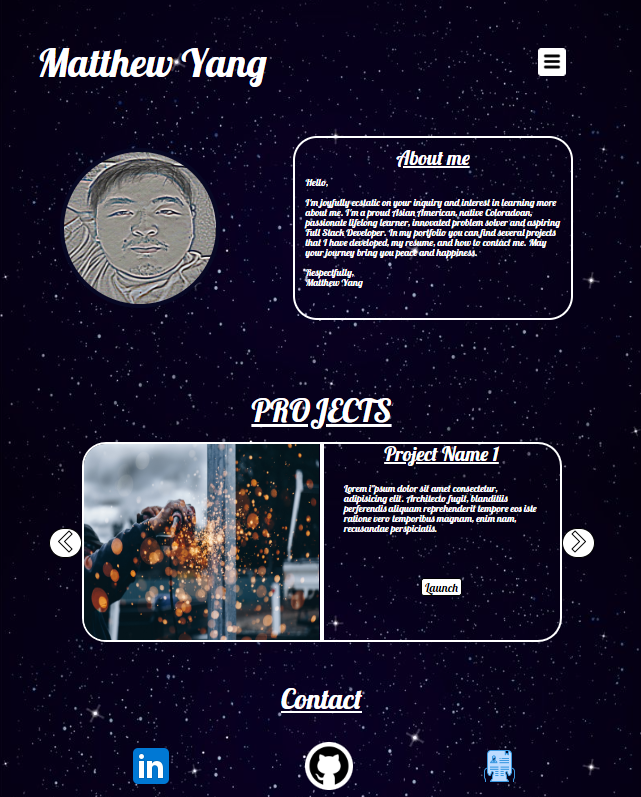

# Matthew Yang's Portfolio

## Description

In this project you will find my professional portfolio. As a full stack developer I enjoy all aspects of technology and continuously learning. My portfolio displays my talents, skills and projects that I have developed. The following technologies were used to build this portfolio. 

CSS 
* Media queries to compensate for mobile and desktop applications      
* Pseudo Classes and @keyframes for added visual effect
* Universal, class, and element selectors 
* No frameworks

HTML
* Semantic HTML5
* No frameworks

JavaScript
* ECMAScript 6
* Arrow functions

## Installation
Access to repository here:
[Repository url](https://github.com/myang5t3r/Professional_Portfolio)

Live Deployment here:
[https://myang5t3r.github.io/Professional_Portfolio/](https://myang5t3r.github.io/Professional_Portfolio/)

## Usage

The usages of this project is for informational and learning purposes only. 

## Credits

Slideshow/carousel 
* https://www.w3schools.com/howto/howto_js_slideshow.asp

